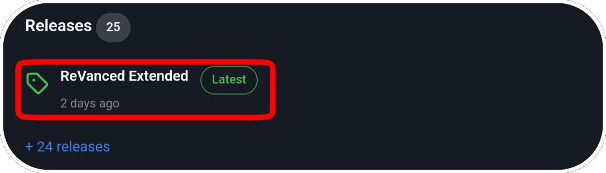
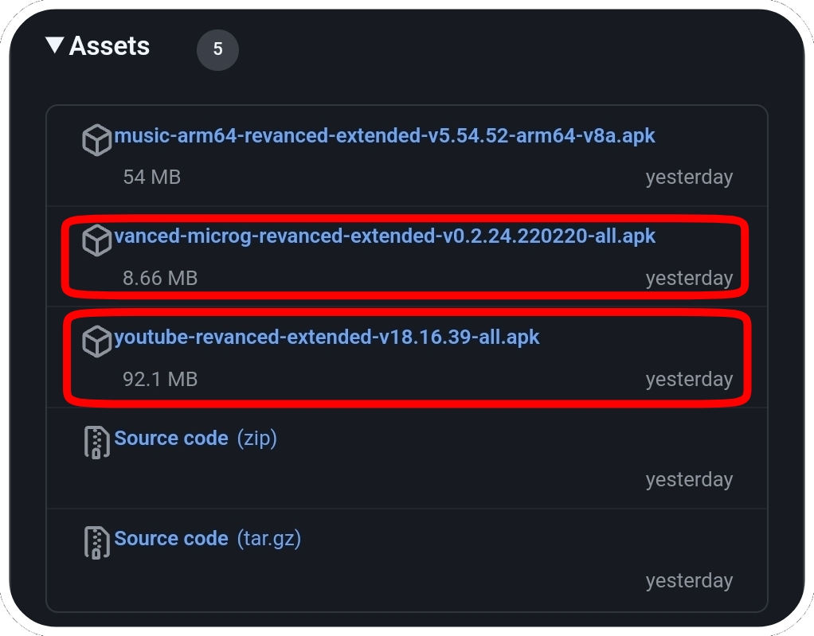
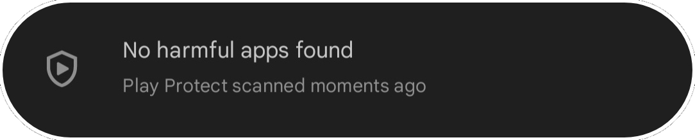
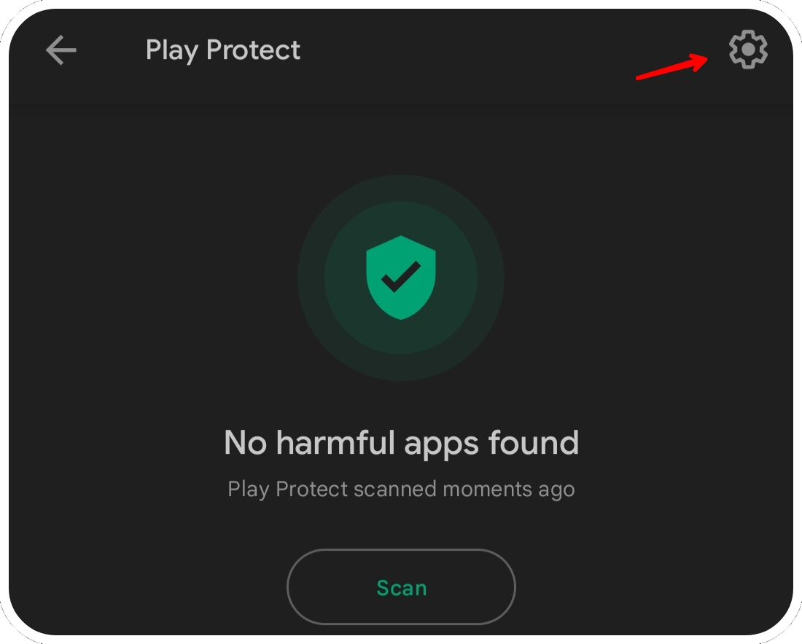
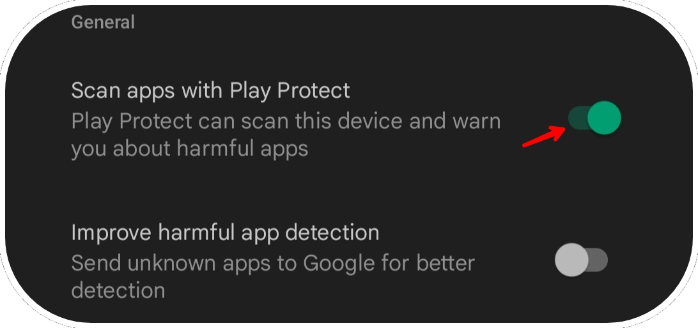
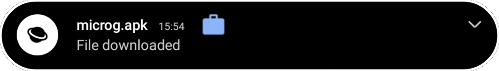
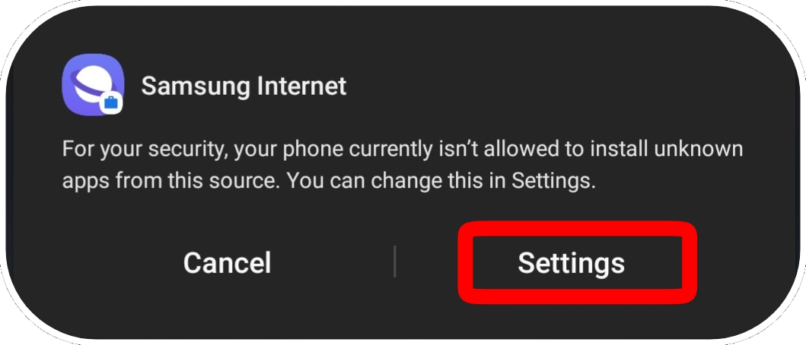
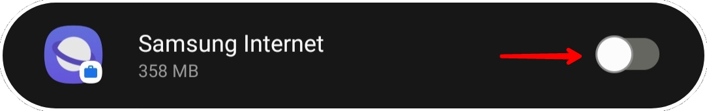
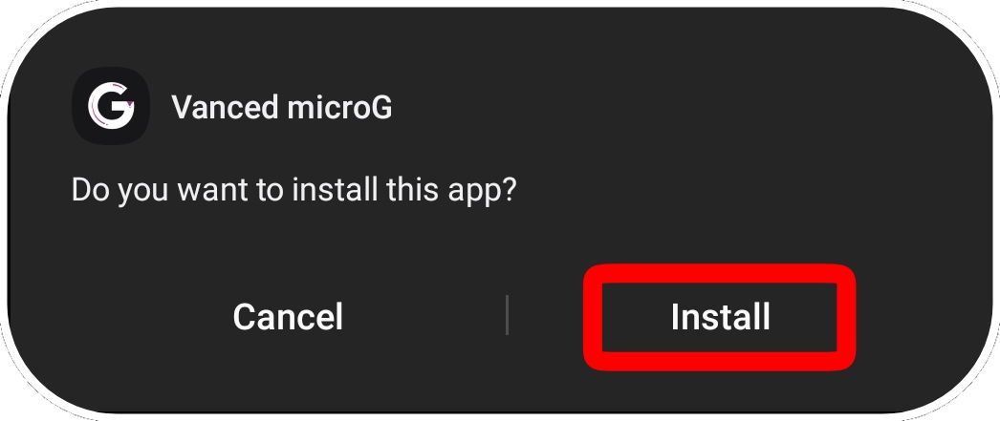

# 
How to install ReVanced/Extended?
#### 
Please note that the signatures are different from ReVanced Manager. You will not be able to install these applications without uninstalling the application patched by RV Manager first (remember to export your settings before uninstalling it) (you can however update the applications present here, the signatures do not change).
#### 
This installation guide is for Extended, but works the same way for ReVanced.
#

Go to release:
    

Click on the release you want to download (for example YouTube Extended) and on Vanced Microg* Revanced release

*for non-rooted devices, Vanced MicroG is required to use your Google account.
    

---

This step is optional, but if the applications refuse to install, it is possible that Google Play Protect is preventing the installation. In these cases, and only in these cases, follow this step.

Go to the Google Play Store and click on your profile picture and press:
    

click on "No harmful apps found"
    

Click on the gear at the top right of the screen
    

and disable "Scan apps with Play Protect".
    

If you had to disable it to install these applications, reactivate it once all the steps are finished.

---

click (in the notification bar) on MicroG first
    

if you have never installed applications from the Web, you will have to Enable in the settings "Unknown Sources"
    

and check the browser that allowed you to download it
    

Another pop-up will appear, 
click on "install".
    

Once MicroG is installed, click on YouTube Extended (in the notification bar) and click on "Install"

and you're done. In YouTube settings, go to the "ReVanced Extended" tab, then to "Miscellaneous", Click on "Open MicroG" to be able to connect to your Google Account.
