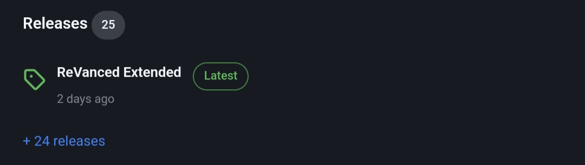
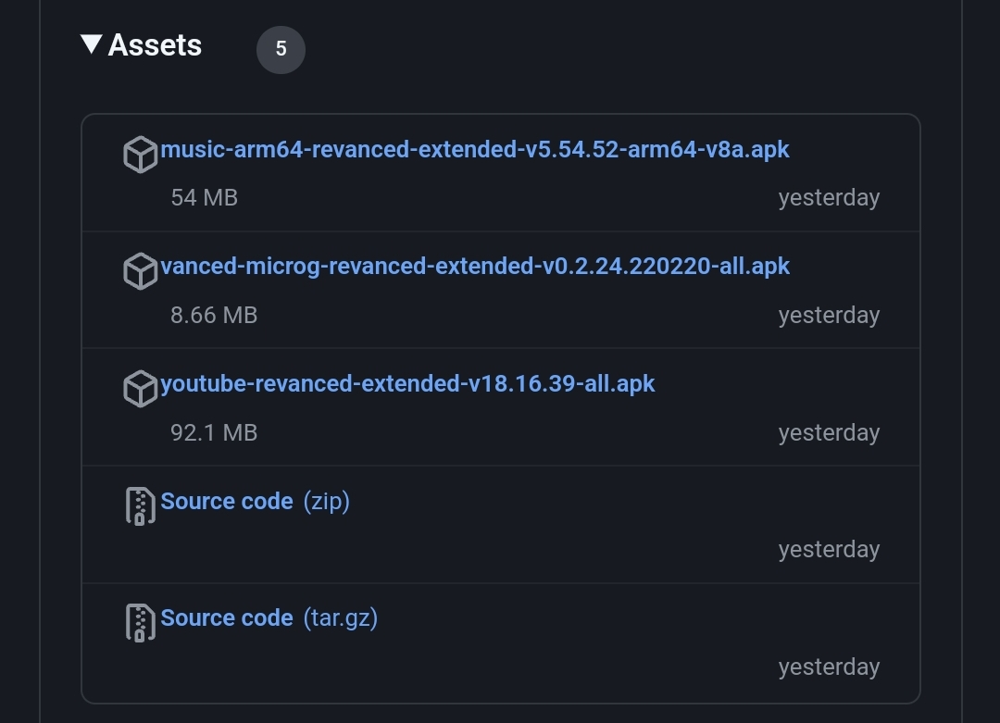
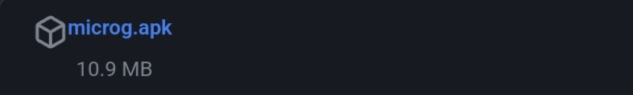
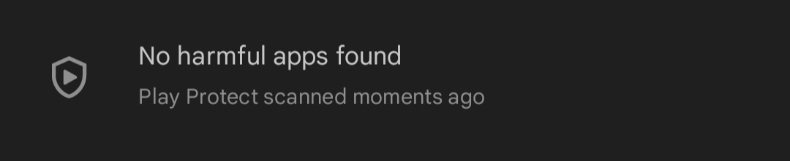
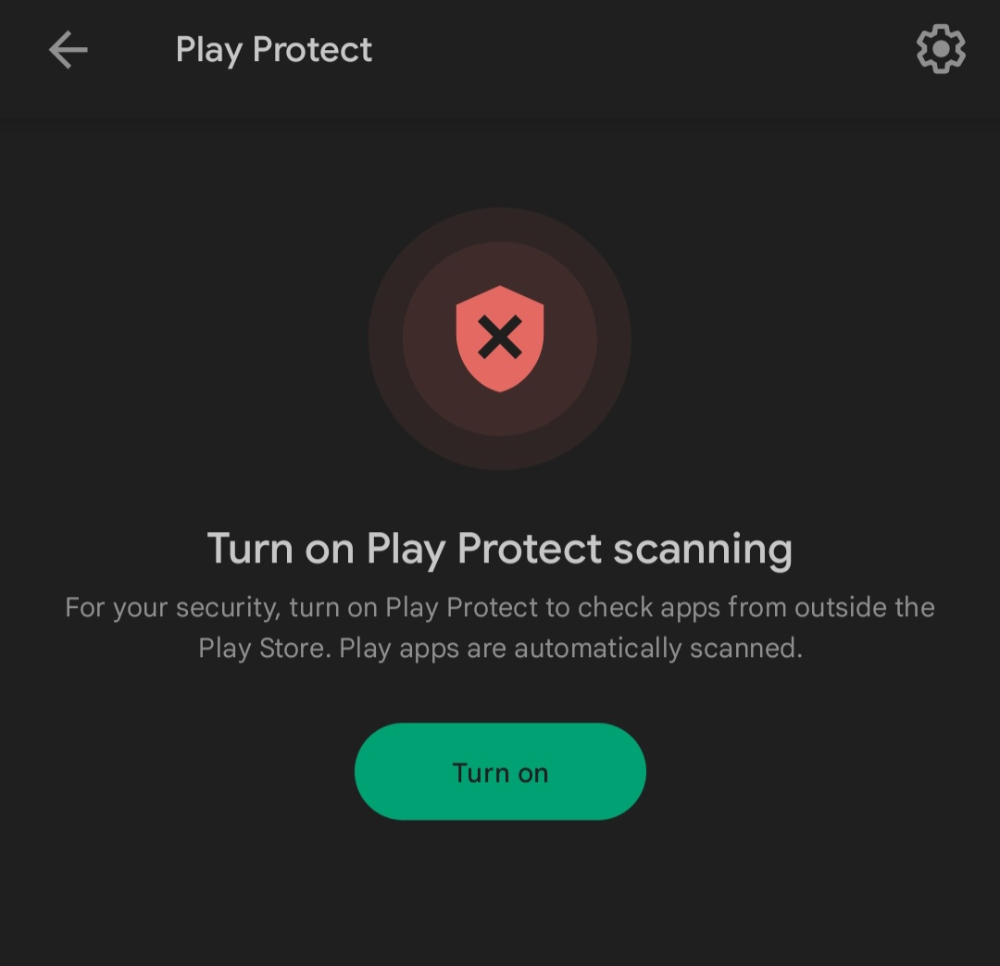
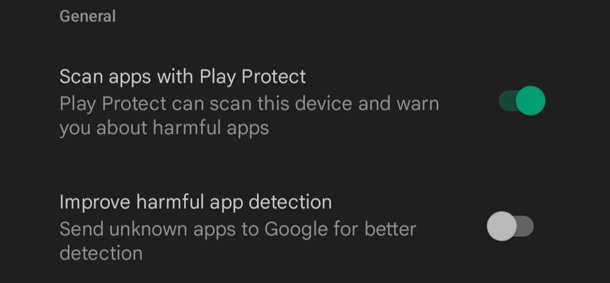
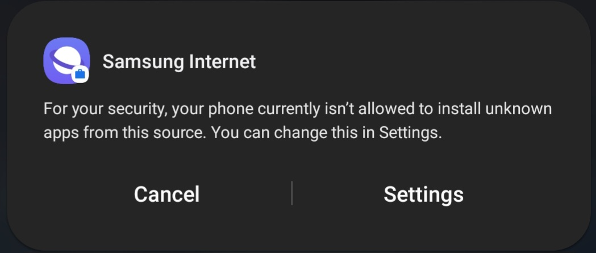
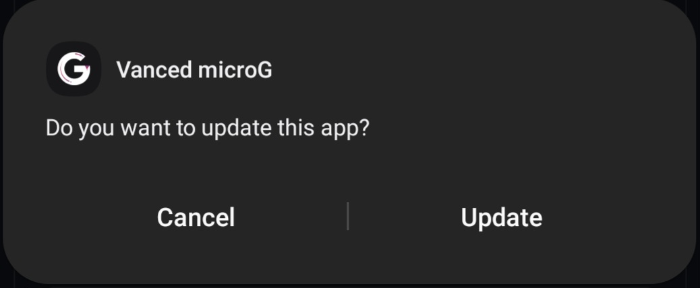

# How to install Extended?

Go to release:
    
Click on the release you want to download (for example YouTube Extended) and then click on Vanced Microg
    

at the bottom of the page, click on Microg.apk
    

During the download, we will disable Play Protect which will prevent us from installing (since it has not been downloaded from the Play Store)
Go to the Google Play Store and click on your profile picture and press
    

in your case, click on "No harmful apps found"
    
Click on the gear at the top right of the screen
    
and deactivate "Scan apps with Play Protect".
    
this step is finished, the application should be downloaded now, click (in the notification bar) on Microg first
    
if you have never installed applications from the Web, you will have to Enable in the settings "Unknown Sources"
    
and check the browser that allowed you to download it
    
    Another pop-up will appear, 
(for my part, Vanced Microg is already installed)
click on "install".
    
Once Microg is installed, click on YouTube Extended (in the notification bar) and click on "Install"

and you're done. In YouTube settings, go to the "ReVanced Extended" tab, then to "Miscellaneous", Click on "Open MicroG" to be able to connect to your Google Account and find your subscriptions, likes and comments.
